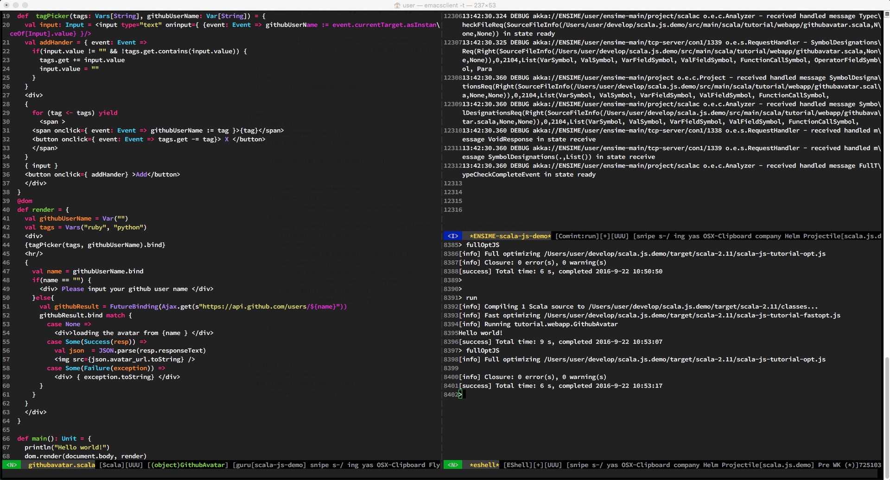

### binding.scala demo

#### follow tutorial setup scala.js environment

[scala-js.org/tutorial/basic/](http://www.scala-js.org/tutorial/basic/)

#### develop @emacs

> sbt gen-ensime

> M-x ensime

#### run

> sbt

    run
    fastOptJS
    fullOptJS

> php -S 0.0.0.0:8080

OR

> python -m SimpleHTTPServer
